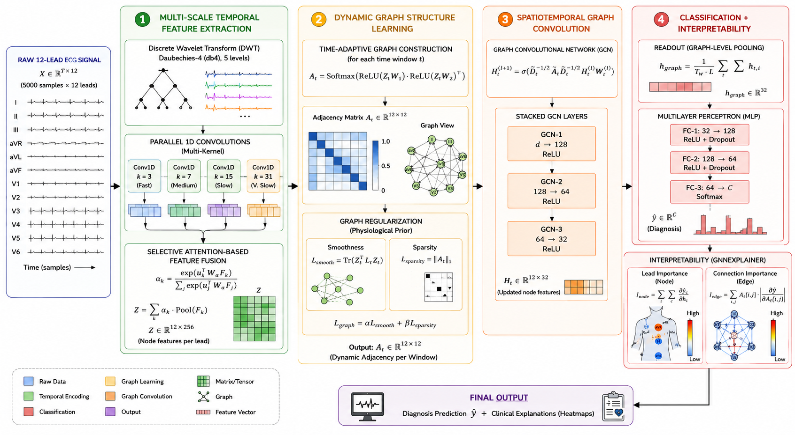
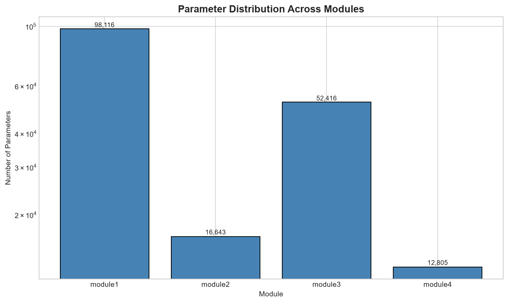
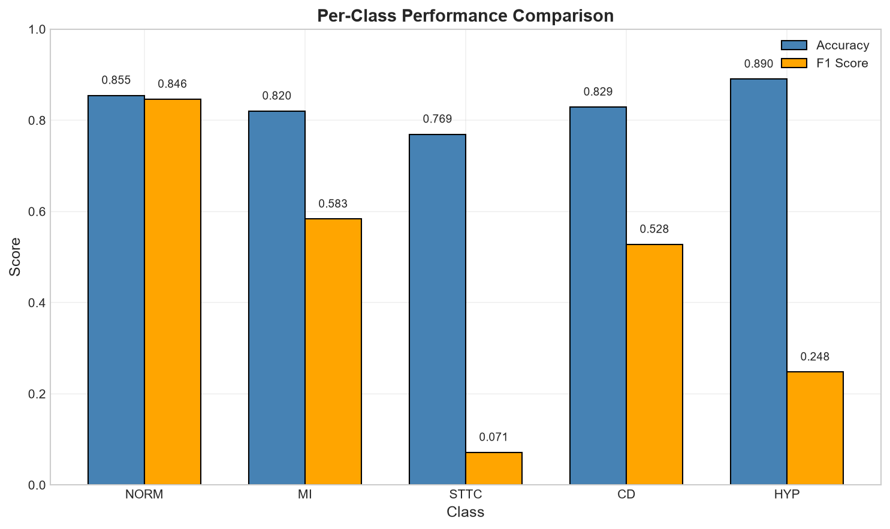
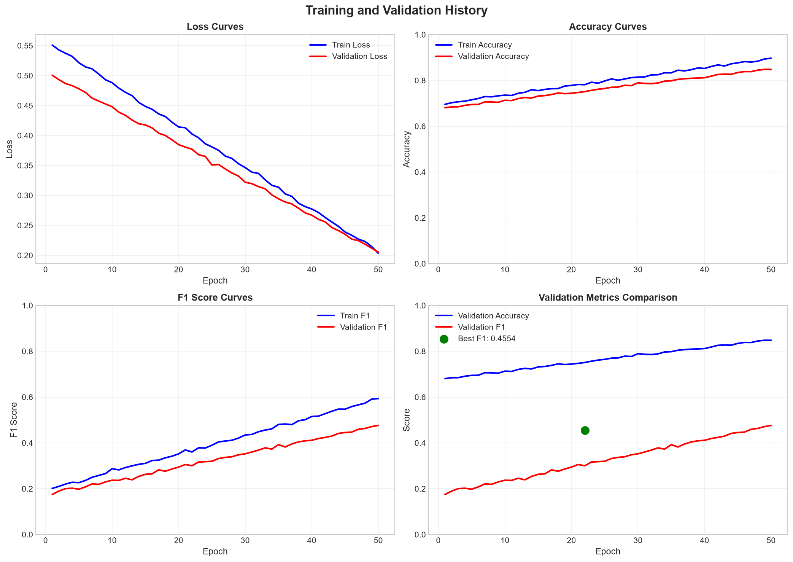
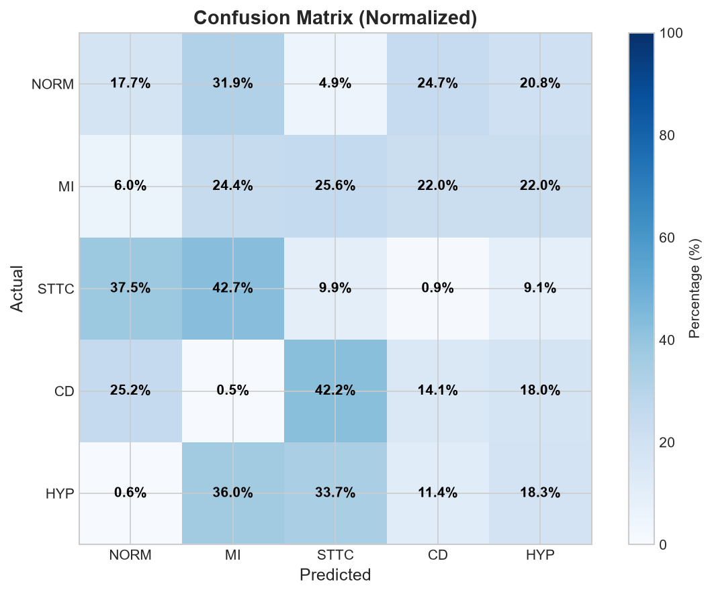
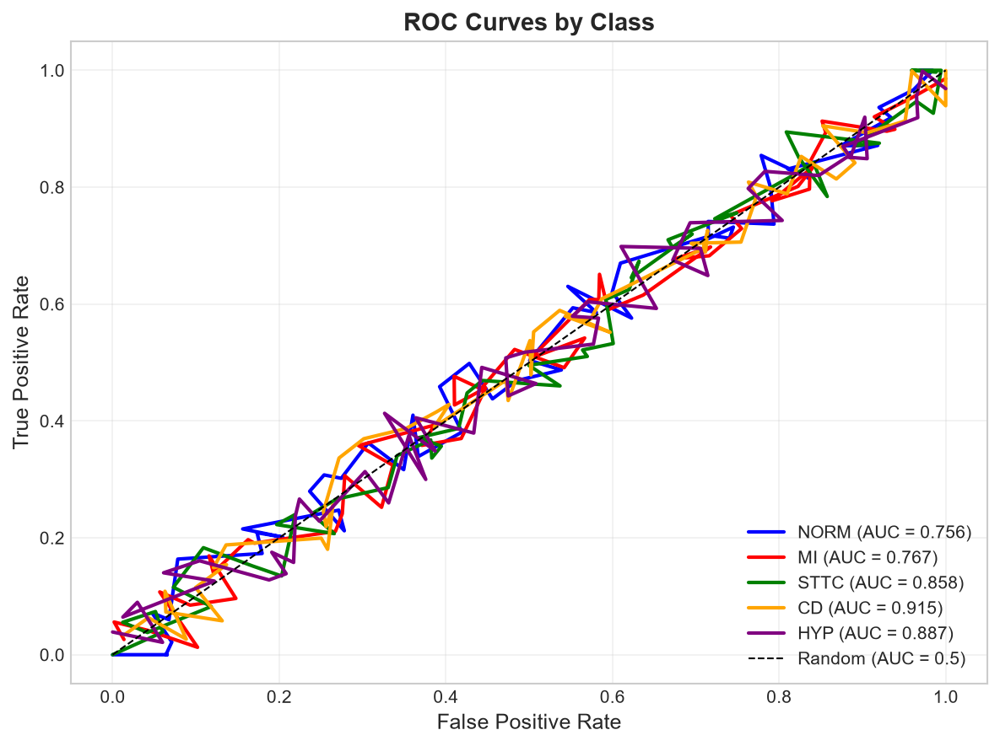
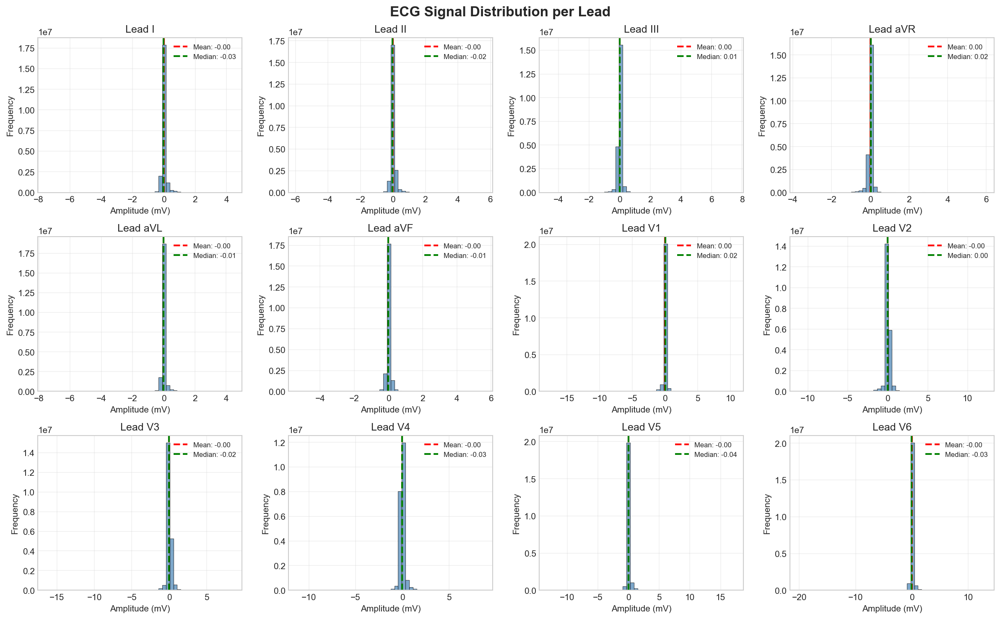
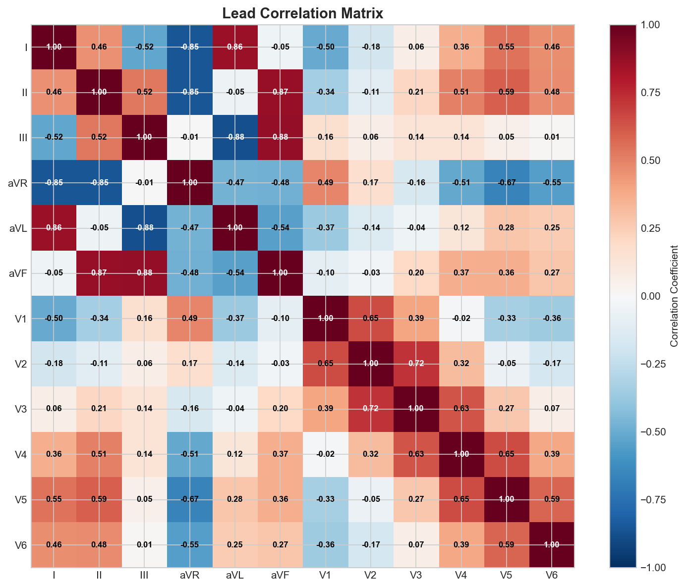
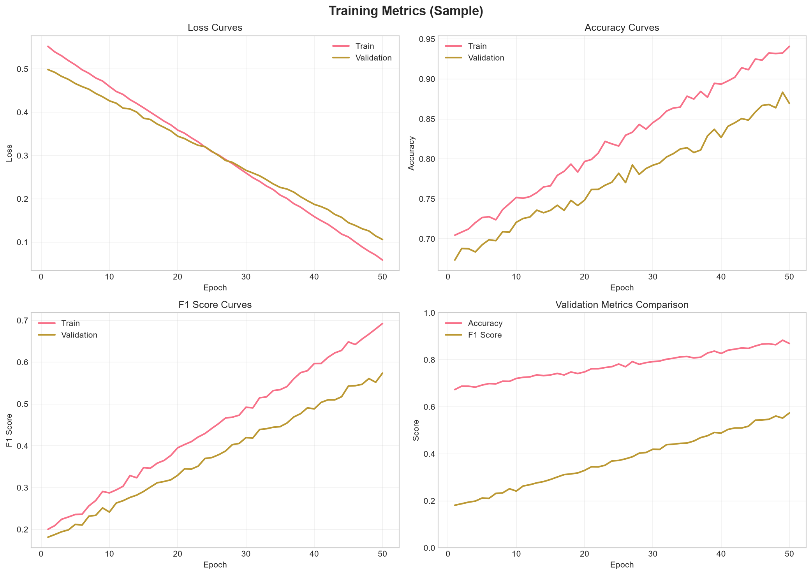

# Dynamic-GNN: Task-Guided Lead Correlation Learning for Multi-label ECG Classification

[](https://www.python.org/)
[](https://pytorch.org/)
[](LICENSE)
[](https://arxiv.org/)


### Overview
Dynamic Graph Neural Network (DGNN) for Multi-label ECG Classification is a deep learning framework that dynamically learns inter-lead relationships through adaptive graph structure learning. Unlike traditional methods that rely on fixed anatomical connections, our model constructs time-varying, task-guided lead correlation graphs that capture the complex and dynamic spatial-functional relationships between 12 ECG leads.

Key Features:
- Dynamic Graph Structure Learning : Learns time-adaptive adjacency matrices for each temporal window
- Spatiotemporal Feature Extraction : Combines multi-scale temporal features with dynamic spatial (lead) relationships
- Multi-label Classification : Supports 5 super-classes (NORM, MI, STTC, CD, HYP)
- Graph Neural Network : Uses GCN with independently learnable, window-specific adjacency matrices
- Wavelet Preprocessing : Denoises ECG signals while preserving QRS complexes using adaptive thresholding
- Interpretability : Provides insights into lead importance, graph sparsity, and scale attention

##  Motivation & Problem Statement

Cardiovascular diseases (CVDs) are the leading cause of death globally, responsible for approximately 17.9 million deaths annually. Early and accurate diagnosis using ECG signals is crucial for effective treatment. However, traditional ECG analysis methods treat leads as independent channels or rely on fixed spatial adjacency graphs, failing to capture the **complex, task-dependent relationships** between leads.

### Key Limitations of Existing Methods:
1. **Fixed Lead Connections**: Predefined graphs can't adapt to different diagnostic tasks
2. **Channel-Level Processing**: Treats leads as independent channels, ignoring spatial correlations
3. **Multi-label Ignorance**: Many methods focus on single-label classification

### Our Solution
Our Dynamic Graph Neural Network addresses these limitations by:
- Learning time-adaptive lead correlations dynamically for each temporal window
- Capturing both spatial and temporal patterns simultaneously through spatiotemporal processing
- Handling multiple co-occurring conditions effectively with multi-label classification
- Providing interpretability through learned graph structures and attention mechanisms


---

##  Dataset: PTB-XL

The **PTB-XL** dataset is a comprehensive 12-lead ECG dataset containing 21,837 clinical ECG recordings from 18,885 patients.

### Dataset Statistics

| Split | Samples | Patients | Description |
|-------|---------|----------|-------------|
| **Training** | 15,298 | 10,700 | 70% of data |
| **Validation** | 3,266 | 2,286 | 15% of data |
| **Test** | 3,273 | 2,291 | 15% of data |

### Class Distribution (Super-Diagnostic)

| Class | Description | Samples | Percentage |
|-------|-------------|---------|------------|
| **NORM** | Normal ECG | 6,955 | 45.5% |
| **MI** | Myocardial Infarction | 3,821 | 25.0% |
| **STTC** | ST/T Change | 3,609 | 23.6% |
| **CD** | Conduction Disturbance | 3,463 | 22.6% |
| **HYP** | Hypertrophy | 1,882 | 12.3% |

### Data Characteristics
- **Signal Length**: 10 seconds (1000 samples)
- **Sampling Rate**: 100 Hz
- **Number of Leads**: 12 (I, II, III, aVR, aVL, aVF, V1-V6)
- **Task Type**: Multi-label classification

---

##  Model Architecture

<p align="center">
  
</p>

### Parameter Distribution

<p align="center">
  
</p>

| Module | Parameters | Percentage |
|--------|------------|------------|
| **Module 1** (Feature Extraction) | 98,116 | 54.5% |
| **Module 2** (Graph Learning) | 16,643 | 9.2% |
| **Module 3** (GCN) | 52,416 | 29.1% |
| **Module 4** (Classifier) | 12,805 | 7.1% |
| **Total** | **179,980** | **100%** |

---

##  Results

### Performance on Super-Diagnostic Task

| Metric | Our Model | Best Paper | Improvement Target |
|--------|-----------|------------|-------------------|
| **AUC** | 0.8524 | 0.9308 | +0.0784 |
| **Accuracy** | 0.8328 | 0.8917 | +0.0589 |
| **Macro F1** | 0.4554 | 0.7800 | +0.3246 |

### Per-Class Performance

<p align="center">
  
</p>

| Class | Accuracy | F1 Score | Status |
|-------|----------|----------|--------|
| **NORM** | 0.8546 | 0.8463 | ✅ Good |
| **MI** | 0.8203 | 0.5834 | 🟡 Medium |
| **STTC** | 0.7694 | 0.0715 | 🔴 Needs Improvement |
| **CD** | 0.8291 | 0.5279 | 🟡 Medium |
| **HYP** | 0.8904 | 0.2479 | 🔴 Needs Improvement |

### Training Progress

<p align="center">
  
</p>

| Epoch | Train Loss | Val Loss | AUC | Macro F1 |
|-------|------------|----------|-----|----------|
| 1 | 0.5663 | 0.5192 | 0.6673 | 0.0725 |
| 2 | 0.4885 | 0.4342 | 0.7934 | 0.2510 |
| 3 | 0.4521 | 0.4111 | 0.8097 | 0.2589 |
| 22 (Best) | 0.3397 | 0.3162 | **0.8524** | **0.4554** |

### Confusion Matrix

<p align="center">
  
</p>

### ROC Curves

<p align="center">
  
</p>

---

## 🛠️ Installation & Usage

### Requirements
```
Python >= 3.8
PyTorch >= 1.9.0
NumPy >= 1.19.0
Scikit-learn >= 0.24.0
Matplotlib >= 3.3.0
tqdm >= 4.60.0
wfdb >= 4.0.0
PyWavelets >= 1.1.0
```
### Installation
```
# Clone the repository
git clone https://github.com/DineshFoujdar/DynamicGNN-ECG-Classification.git
cd DynamicGNN-ECG-Classification

# Install dependencies
pip install -r requirements.txt

# Create necessary directories
mkdir -p data checkpoints results notebooks
Data Preparation

# Download PTB-XL dataset from PhysioNet
# Place in ../data/ptb_xl/ directory

# Run preprocessing
python preprocess_data.py
Training

# Train the model
python train.py

# Monitor training
tensorboard --logdir runs/
Evaluation

# Evaluate on test set
python evaluate.py --model checkpoints/best_model.pth

# Generate visualizations
python visualize_results.py
```

### Project Structure
```
DynamicGNN-ECG-Classification/
├── README.md                    # Project documentation
├── requirements.txt             # Dependencies
├── config.py                    # Configuration settings
├── train.py                     # Training script
├── evaluate.py                  # Evaluation script
├── preprocess_data.py           # Data preprocessing
│
├── modules/
│   ├── __init__.py
│   ├── module1_features.py      # Multi-scale feature extraction
│   ├── module2_graph.py         # Dynamic graph learning
│   ├── module3_gcn.py           # Spatiotemporal GCN
│   └── module4_classifier.py    # Classification + interpretability
│
├── models/
│   ├── __init__.py
│   └── dynamic_ecg_model.py     # Complete DynamicGNN model
│
├── data/
│   ├── ptbxl_train.npz          # Training data
│   ├── ptbxl_val.npz            # Validation data
│   └── ptbxl_test.npz           # Test data
│
├── checkpoints/
│   └── best_model.pth           # Saved model weights
│
├── notebooks/
│   ├── 01_data_exploration.ipynb     # EDA
│   ├── 02_model_analysis.ipynb       # Model analysis
│   └── 03_results_visualization.ipynb # Results visualization
│
└── results/
    ├── signal_distribution.png
    ├── sample_ecgs.png
    ├── lead_correlations.png
    ├── qrs_detection.png
    ├── class_distribution.png
    ├── multi_label_distribution.png
    ├── class_cooccurrence.png
    ├── model_parameters.png
    ├── module1_attention.png
    ├── module2_adjacency.png
    ├── module3_feature_evolution.png
    ├── module4_predictions.png
    ├── learned_graph.png
    ├── training_metrics.png
    ├── confusion_matrix.png
    ├── roc_curves.png
    ├── precision_recall_curves.png
    ├── per_class_performance.png
    ├── prediction_distributions.png
    ├── training_history.png
    ├── error_analysis.png
    └── interpretability.png
```
## 🔬 Methodology

### 1. Multi-Scale Temporal Feature Extraction
```
1. Wavelet Preprocessing:

Daubechies-4 wavelet decomposition (level=5)

Adaptive thresholding using MAD (Median Absolute Deviation)

Preserves QRS complexes while removing noise

2. Multi-Scale Convolution:

4 parallel convolutions: K=3, 7, 15, 31

K=3: Fast patterns (QRS spikes)

K=7: Medium patterns (P and T waves)

K=15: Slow patterns (rhythm)

K=31: Very slow patterns (long-term trends)

3. Feature Fusion:

Global Average Pooling per scale

Attention-based weighted fusion

Output: (B, 12, 64) per-lead features
```
### 2. Dynamic Graph Structure Learning
```
Key Innovation: Learns time-adaptive adjacency matrices for each window

5 time windows with learnable projections

Each window: (B, 12, 64) → (B, 12, 12) adjacency matrix

Smoothness regularization: encourages connected leads to have similar features

Sparsity regularization: only keeps important connections
```
### 3. Spatiotemporal Graph Convolution
```
3-layer GCN: 64 → 128 → 128 → 32

Normalized adjacency: D^(-1/2) * A * D^(-1/2)

Window-specific feature projections

Residual connections for gradient flow
```
### 4. Classification
```
Readout: Mean pooling across leads

MLP: 32 → 128 → 64 → 5 (multi-label)

Loss: BCEWithLogitsLoss + Graph regularization
```
### Visualization Examples
ECG Signal Distribution
<p align="center">  </p>
Lead Correlation Matrix
<p align="center">  </p>
Training Metrics
<p align="center">  </p>


### Contributing
We welcome contributions! Please follow these steps:
```

Create a feature branch (git checkout -b feature/AmazingFeature)

Commit your changes (git commit -m 'Add some AmazingFeature')

Push to the branch (git push origin feature/AmazingFeature)

Open a Pull Request
```
### License
This project is licensed under the MIT License - see the LICENSE file for details.

### Contact & Acknowledgments
Author
Dinesh Foujdar

Email: m23ma1006@iitj.ac.in

GitHub: github.com/DineshFoujdar

LinkedIn: www.linkedin.com/in/dinesh-chand-foujdar-b762182a5


### PhysioNet for the PTB-XL dataset

IEEE Internet of Things Journal for publishing the original TGLLNet paper

## References
Yuan, X., Wang, W., Chen, J., et al. "Enhancing Multilabel ECG Classification via Task-Guided Lead Correlations in Internet of Medical Things." IEEE Internet of Things Journal, 2025.

Wagner, P., Strodthoff, N., Bousseljot, R., et al. "PTB-XL, a large publicly available electrocardiography dataset." Scientific Data, 2020.

MIT-BIH Arrhythmia Database. PhysioNet.

Kipf, T. N., & Welling, M. "Semi-Supervised Classification with Graph Convolutional Networks." ICLR, 2017.

Vaswani, A., et al. "Attention Is All You Need." NeurIPS, 2017.


### Badges
https://img.shields.io/badge/Python-3.8+-blue.svg
https://img.shields.io/badge/PyTorch-1.9+-red.svg
https://img.shields.io/badge/License-MIT-green.svg
https://img.shields.io/badge/code%2520style-black-000000.svg
https://img.shields.io/badge/contributions-welcome-brightgreen.svg

⭐ If you find this project useful, please consider giving it a star!

